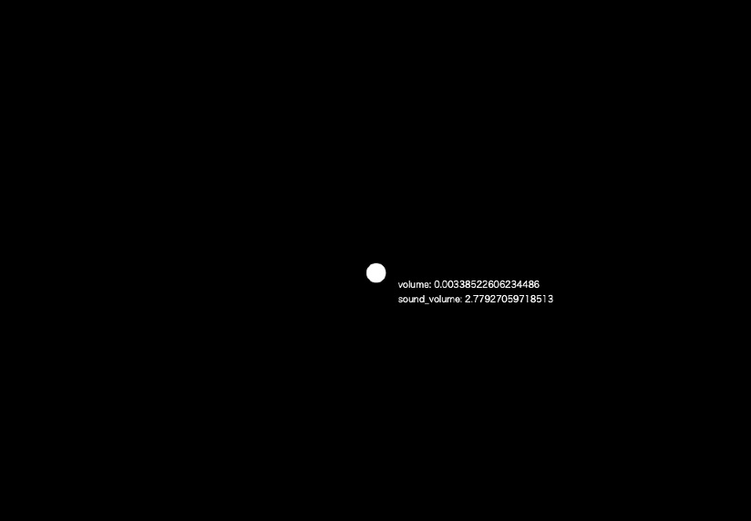
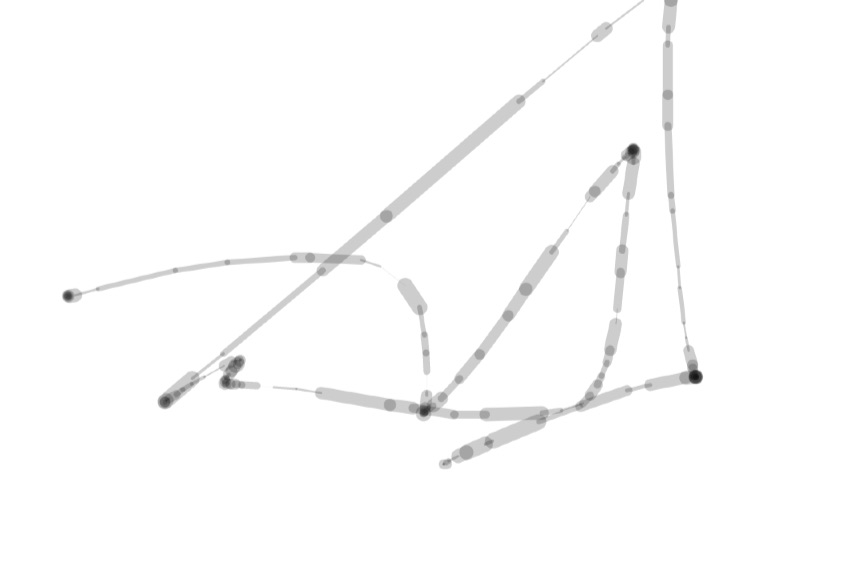
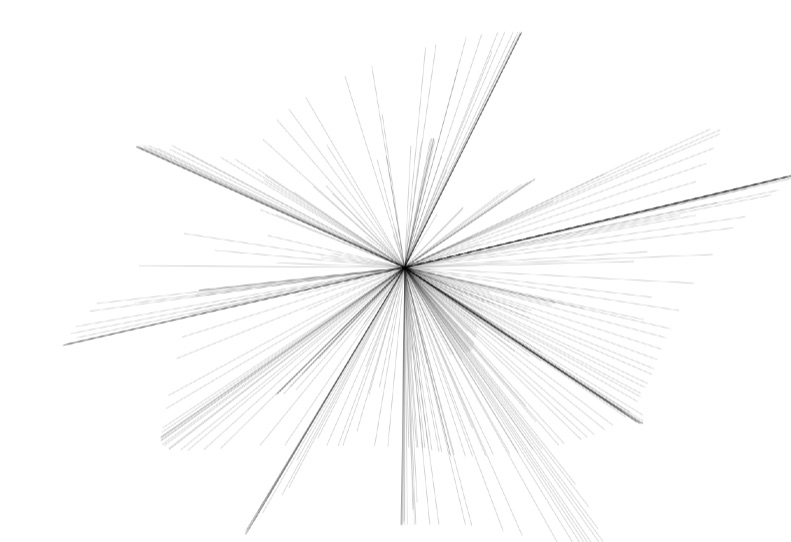

# sandbox p5.js

## template

main.ts

```
/// <reference path="../node_modules/@types/p5/global.d.ts" />
import p5 from "p5";

const sketch = (p: p5) => {
  p.setup = () => {

  };

  p.draw = () => {

  };
};

new p5(sketch);
```

---

### volume-circle



### stroke



### mouse-radiation


